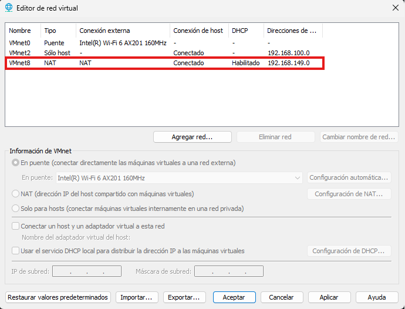
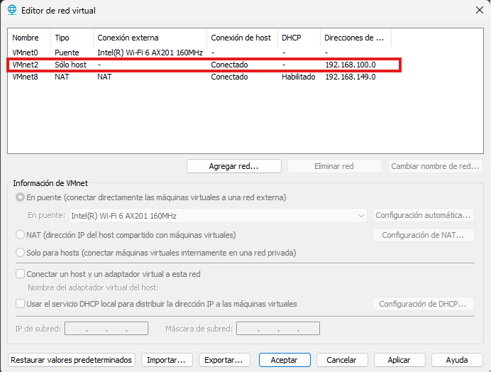

# Configuración de la Red

La configuración de la red constituye la base del laboratorio **SOC-Lab**. En esta fase se prepara la infraestructura virtual que permitirá la comunicación entre todos los sistemas del entorno, utilizando **FortiGate** como dispositivo central para el enrutamiento, el filtrado del tráfico y la asignación de direcciones IP.

---

## Arquitectura de la Red

| Componente | Configuración |
|------------|---------------|
| Plataforma de virtualización | VMware Workstation |
| Red externa (WAN) | VMnet8 (NAT) |
| Red interna (LAN) | VMnet2 (Host-Only) |
| Rango de red | 192.168.100.0/24 |
| Máscara de subred | 255.255.255.0 |
| Gateway predeterminado | 192.168.100.1 |
| Servidor DHCP | FortiGate |
| DHCP de VMware | Deshabilitado |

---

## Diseño de la Infraestructura

```
                              Internet
                                  │
                           VMnet8 (NAT)
                                  │
                          ┌────────────────┐
                          │   FortiGate    │
                          │ Gateway · DHCP │
                          └───────┬────────┘
                                  │
                      VMnet2 (Host-Only / LAN)
                                  │
          ┌────────────┬────────────┬────────────┬────────────┐
          │            │            │            │
      Wazuh Server  Windows Server  Windows 10  Kali Linux
```

---

## Direccionamiento IP

| Dispositivo | Sistema Operativo | Dirección IP | Función |
|--------------|-------------------|--------------|---------|
| FortiGate | FortiOS | 192.168.100.1 | Gateway, Firewall y DHCP |
| Wazuh Server | Ubuntu Server | 192.168.100.10 | SIEM / XDR |
| Windows Server | Windows Server 2022 | 192.168.100.20 | Active Directory y DNS |
| Cliente | Windows 10 | DHCP | Endpoint monitoreado |
| Atacante | Kali Linux | DHCP | Simulación de ataques |

---

## Evidencias

Las siguientes capturas documentan la configuración inicial de la infraestructura de red.

### Configuración de VMnet8 (NAT)

La siguiente captura muestra la configuración de **VMnet8**, utilizada como red **NAT (WAN)** del laboratorio. Esta red proporciona acceso a Internet a la máquina virtual de **FortiGate**, permitiendo la comunicación con redes externas. El servicio **DHCP de VMware** permanece habilitado en esta red para facilitar la conectividad.



> **Figura 1.** Configuración de la red **VMnet8 (NAT)** utilizada como conexión WAN del laboratorio.

---

### Configuración de VMnet2 (Host-Only)

La siguiente captura muestra la configuración de **VMnet2**, utilizada como red **Host-Only (LAN)** del laboratorio. Esta red está destinada exclusivamente a la comunicación entre las máquinas virtuales. El servicio **DHCP de VMware** fue deshabilitado para que **FortiGate** gestione la asignación de direcciones IP dentro de la red interna.



> **Figura 2.** Configuración de la red **VMnet2 (Host-Only)** utilizada como red interna del laboratorio.

## Resultado

Con esta configuración se estableció la infraestructura de red que servirá como base para el laboratorio SOC-Lab. A partir de este punto, todas las máquinas virtuales se conectarán a través de FortiGate, el cual gestionará el enrutamiento, el filtrado del tráfico y la asignación de direcciones IP de la red interna.
