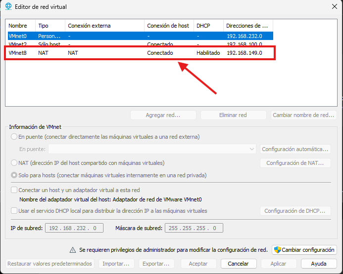
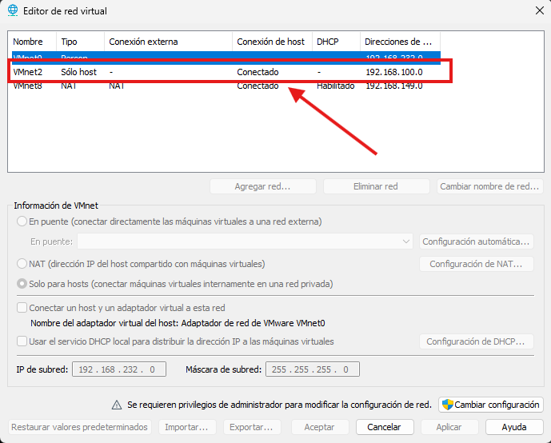

# 🌐 Configuración de la Red

Esta sección documenta la configuración de red utilizada para conectar los diferentes componentes del laboratorio SOC.

## Objetivo

Crear una red virtual aislada donde OPNsense actúe como gateway, firewall y servidor DHCP para los dispositivos internos.

## Diseño de red

La infraestructura utilizará dos redes virtuales:

### VMnet8 — WAN

Se utilizará como interfaz WAN de OPNsense para proporcionar acceso a Internet mediante NAT de VMware.

La red VMnet8 utiliza el modo **NAT**, permitiendo que la interfaz WAN de OPNsense obtenga conectividad hacia Internet a través del host.



### VMnet2 — LAN

Se utilizará como red interna del laboratorio SOC.

VMnet2 utiliza la red `192.168.100.0/24`. El servicio DHCP de VMware estará deshabilitado en esta red, ya que **OPNsense será el encargado de asignar las direcciones IP** a los dispositivos internos.



## Esquema de direccionamiento

```text id="95f6tr"
Red LAN:       192.168.100.0/24
Gateway:       192.168.100.1
Servidor DHCP: OPNsense
```

## Componentes conectados

* Wazuh Server
* Windows Server 2022
* Windows 10
* Kali Linux

## Verificación

Una vez implementada la infraestructura, se realizarán pruebas para verificar:

* Asignación correcta de direcciones IP mediante DHCP.
* Comunicación entre los dispositivos de la red interna.
* Conectividad con el gateway `192.168.100.1`.
* Resolución DNS.
* Acceso a Internet a través de OPNsense.

